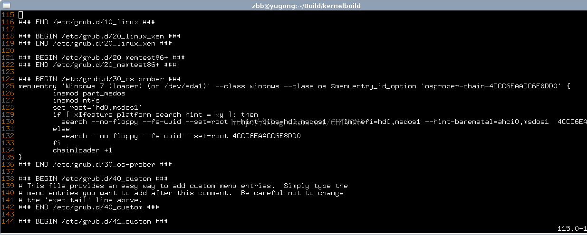

# 1. 下载镜像 制作启动U盘
Arch Linux 官方网站 https://www.archlinux.org/

制作启动盘工具 [UltralISO](https://cn.ultraiso.net/uiso9_cn.exe)

Linux下
```
dd if=*iso of /dev/sdb bs=41M
```

# 2. 网络连接
参考 [Linux配置网络及SSH配置](Linux配置网络及SSH配置.md)
# 3. 选择软件源
推荐国内的用户选择http://mirrors.ustc.edu.cn 默认的mirrorlist是开启所有源的，因此我们使用sed先在所有源的前面加上#
``` 
#sed -i "s/^\b/#/g" /etc/pacman.d/mirrorlist
#nano /etc/pacman.d /mirrorlist
```
将mirrors.ustc.edu.cn前面的#去掉
# 4. 分区/格式化/挂载
 参考 [分区/格式化/挂载](Linux分区.格式化.挂载.md)  

# 5. 安装基本系统

## 1. 将基本系统安装到根目录上去

    ```
    #pacstrap /mnt base base-devel
    ```
        
    其实，这里安装的基本系统也肯定有自己用不到的冗余功能，例如我就用不到nano文本编辑器，但系统会默认给安上。如果知道基本系统每个文件的作用，其实也完全可以自定义安装。比如：
    
    ```
    #pacstrap /mnt bash coreutils file filesystem grub2 linux pacman \
        procps-ng syslog-ng glibc systemd-sysvcompat shawd dhcpcd vi
    ```
    
    > 如果你想使用ifconfig之类的工具，请在上面加上net-tools

## 2. 生成fstab

    用下面命令生成 fstab。如果想使用 UUIDs，使用 -U 选项；如果想使用标签，用 -L 选项.
    
    ```
    #genfstab -U -p /mnt >>/mnt/etc/fstab
    ```
    
    > [red]**后面如果出现问题，请不要再次运行genfstab**[red]，如果需要，手动编辑/etc/fstab
    /etc/fstab文件在运行genfstab后应该被检查一下。如果之前你生成了一个EFI系统分区，那么 genfstab给EFI分区添加了错误的选项，会导致无法启动。因此你需要移除EFI分区的所有选项，除了noatime. 对其他分区, 替换"codepage=cp437" 为 "codepage=437" , 会挂载失败导致systemd进入恢复模式。

## 3. 切换到新系统中
    ```
    #arch-chroot /mnt
    #sh-4.2#bash
    ```
    > 到这一步之后，开始系统的主要配置，如果下面文件不存在，需要手动创建。
    > 理解并完全安装步骤设置是保证系统配置成功的关键。

## 4. 对新的基本系统进行设置

#### 写入本机的字符编码方式

```
#nano /etc/locale.conf #

LANG=en_US.UTF-8 #简略写法 echo LANG= en_US.UTF-8 >> locale.conf
```

> locale.conf 文件默认不存在，一般设置LANG就行了，它是其它设置的默认值。

```
/etc/locale.conf

LANG=zh_CN.UTF-8
LC_TIME=en_GB.UTF-8
```

#### 修改本机编码

```
# nano /etc/locale.gen  将用不到的编码全删掉，只保留en_US与zh_CN的几行。 
```

> 默认情况下 /etc/locale.gen 是一个仅包含注释文档的空文件。选定你需要的本地化类型(移除前面的＃即可), 比如中文系统可以使用:

```
en_US.UTF-8 UTF-8
zh_CN.GB18030 GB18030
zh_CN.GBK GBK
zh_CN.UTF-8 UTF-8
zh_CN GB2312
```

对系统的编码进行更新

```
#locale-gen 
```

#### 写入本机的名称

```
# nano /etc/hostname #简略写法：echo {name} >/etc/hostname，也是一样的。
```


#### 写入键盘布局方案 

```
#nano /etc/vconsole.conf
```
美式键盘，如下：

```
KEYMAP=us
FONT=
FONT_MAP=
```

#### 写入时区

```
# nano /etc/timezone

Asia/Shanghai
```

#### 建立时区的软链接

```
#ln -s /usr/share/zoneinfo/Asia/Shanghai /etc/localtime
```

#### 设定系统将用的时间方案

```
#hwclock --systohc --utc
```

> 这个时间方案我是试过很多次，如果是双系统，电脑里还有win系统的话，建议设为：--localtime，否则可设为—utc。不过，我现在虽然也用双系统，但还是设的utc，因为设为--localtime虽然在win下时间不会出错，但回到linux下，经常系统会有些古怪的问题，比如，升级系统之时，报密钥错误。使用--utc，虽然在linux下时间会慢8个多小时，但毕竟对整个系统没有影响。

生成内核的启动镜象。

```
#mkinitcpio -p linux
```


#### 安装必要工具

> 安装必要的网络工具以便于开机后可以配置网络连接(包括无线)

```    
#pacman –S wpa_supplicant net-tools
#pacman -S dialog
#pacman -S netctl
#pacman -S wireless_tools
```

## 6. 安装引导

#### 安装grub
```
#pacman -S grub-bios os-prober
#grub-install /dev/sda
```
UEFI 注意分区,参考: [Linux分区.格式化.挂载](Linux分区.格式化.挂载.md)

```
#pacman -S grub-bios efibootmgr os-prober
#grub-install --efi-directory=/boot/efi --bootloader-id=arch-grub --target=x86_64-efi
```

#### 生成启动菜单
```

#grub-mkconfig -o /boot/grub/grub.cfg
#nano /boot/grub/grub.cfg
```

#### 生成grub引导windows

如何生成grub引导文件grub.cfg 这里我们需要充分参考点击打开链接grub的说明。首先，需要额外安装一个 `os-prober`的软件包，直接pacman就行；然后grub-makeconfig 到/boot/grub/grub.cfg 。此时才能生成可以引导多系统的引导文件.如下图。 


#### 开机自启网络

````
#systemctl enable dhcpcd@.service
#dhcpcd
````

#### 卸载挂载的分区并重启
```
#umount /mnt/{boot,home,mnt}
# reboot
```

基本系统已安装完成

# 7. 系统配置

>忘记安装net-tools补救

```
ip link show #查看网卡
ip link set eth0 up # 启用网卡
```

>如果是DHCP的当然简单，直接`dhcpcd`即可，如果是固定IP的，则要如下操作：

```
#ip addr add 固定IP/24 dev eth0
#ip link set dev eth0 up
#ip route add default via 网关
```

#### 系统更新

```
#pacman –Syu
```

#### 添加用户
```
#useradd -m 新用户 #新建用户
#passwd 新用户     #指定密码：
#usermod -a -G video,audio,lp,log,wheel,optical,scanner,games,users,storage,power 新用户 #指定用户所在的组 
```

#### sudo权限 
```
nano /etc/sudoers (添加sudo权限)
```

> 放开`%wheel %sudo`权限
#### sudo命令补全

```
#sudo pacman -S bash-completion 
#echo "source /usr/share/bash-completion/bash_completion" >>/home/$USER/.bashrc 
```

#### 更新源列表

```
#pacman -S reflector 
```

reflector是一个可以从arch官方MirrorStatus列表取回最新mirrorlist的脚本，并且可以根据最新同步时间和速度排序。
下面先说如何自动配置源列表。直接终端输入命令5（注意备份原有源列表）
    
```
 #reflector --verbose --country 'China' -l 200 -p http --sort rate --save /etc/pacman.d/mirrorlist
```

#### 安装yaourt

```
#vim /etc/pacman.conf
```

```
[archlinuxcn]
#The Chinese Arch Linux communities packages.
SigLevel = Optional TrustAll
Server   = http://repo.archlinuxcn.org/$arch
```

```
# pacman -Syu yaourt
```

#### 安装powerpill

```
#yaourt -S powerpill
```

> powerpill是一个可以从多个源多线程下载软件包的程序，类似于迅雷一样，可以明显提升更新速度，相当于pacman的外壳程序，使用方法完全和pacman相同。下面说说powerpill，玩arch的人不知道powerpill是不行的，需要注意的是它也是要调用reflector的，但并不是作为依赖。如果安装reflector后powerpill更新前会默认从mirrorstatus取回45个最新更新的源地址，然后并行下载，否则就是读取/etc/pacman.d/mirrorlist然后配置下载。当然我们推荐第一种，总不能每次都手动执行

# 7. 驱动显卡

#### 安装显卡驱动

```
# pacman -S mesa
# lspci | grep VGA（查看本机的显卡类型）
# pacman -Ss xf86-video | less（查看能够安装的显卡类型）
# pacman -S …… 安装显卡驱动（或者可以直接所有驱动都自动安装）
# pacman –S xf86-video-vesa
# pacman –S xf86-video-nouveau  #如果是ATI显卡的话，要安xf86-video-ati; 
# pacman –S virtualbox-guest-utils #虚拟机
```

#### 安装系统基础程序：

```
# pacman -S xorg-server xorg-xinit xorg-utils xorg-server-utils dbus # 先安装x-window服务
# pacman –S xterm xorg-xclock  xorg-twm # 安装测试环境
```

#### 重设系统的编码方式 

编辑`.xinitrc`，把以下内容添加到文件最开始。内可以使用你所喜欢的编辑器，比如`nano`。

```
LANG=zh_CN.UTF-8
LC_ALL="zh_CN.UTF-8"
```

更新系统的编码：

```
#locale-gen
```

更新一下系统的时间
```
# date -s "2013-01-14 14:40:10"
# hwclock --systohc
```

音频管理
```
# pacman -S alsa-utils pulseaudio-alsa
```

安装网络管理工具

```
# pacman –S networkmanager network-manager-applet wireless_tools
# systemctl enable NetworkManager
# systemctl start NetworkManager
```

安装桌面


击右键菜单，找到文件管理器，然后进入到目录`/usr/share/applications/`下，你会看到你已经安装完成的程序，全都可以从这儿启动。此时，你不妨复制几个常用的到你的用户目录：`/home/新用户/桌面/`下去。复制之后，你会在你的桌面上，看到这些程序的启动器。

安装完ibus之后，在`/home/$USER/.xinitrc`文件中，写入：

```
export GTK_IM_MODULE=ibus
export QT_IM_MODULE=ibus
export XMODIFIERS=@im=ibus
ibus-daemon -d -x
```

Windows下的磁盘挂载
    参考[Windows下的磁盘挂载](Windows下的磁盘挂载.md)


Xfce主题

字体及补丁

```
# pacman -S ttf-dejavu ttf-ubuntu-font-family ttf-arphic-ukai ttf-arphic-uming
# pacman -S wqy-microhei wqy-bitmapfont wqy-zenhei ttf-fireflysung
$ yaourt -S cairo-ubuntu libxft-ubuntu freetype2-ubuntu fontconfig-ubuntu       #以普通用户身份执行
```
安装系统主题：

```
sudo pacman -S gtk-aurora-engine gtk-engine-murrine 
```
鼠标主题：

```
sudo pacman -S xcursor-vanilla-dmz xcursor-vanilla-dmz-aa
```

图标主题：

```
# pacman -S gnome-icon-theme-extras oxygen-icons human-icon-theme lxde-icon-theme tangerine-icon-theme
```

针对笔记本电脑的配置：（Speed－step 、 Suspend 等功能）

```
# pacman -S  gnome-power-manager  volumeicon
$ yaourt -S laptop-mode-tools pmount
```

Grub主题
在启动过程中发现Xfce桌面启动载入真心简陋，没有关系，我们在AUR里下载一个balou并设置就好了。
```
$ yaourt -S archlinux-themes-balou
```

下面来配置grub的启动界面。AUR里有一个非常棒的包`grub2-theme-archlinux`。

```
$ yaourt -S grub2-theme-archlinux
```
安装后编辑/etc/default/grub，
将`#GRUB_THEME="/path/to/gfxtheme"`改为`GRUB_THEME="/boot/grub/themes/Archlinux/theme.txt"`
将`GRUB_GFXMODE=auto`改为`GRUB_GFXMODE=1024x768`修改完成后重新生成一下启动文件

```
# grub-mkconfig -o /boot/grub/grub.cfg
```

安装 i3 窗口管理器

```
# pacman -S i3
```

安装 lightdm 显示管理器，

```
# pacman -S lightdm-gtk3-greeter
```
然后 

```
# systemctl enable lightdm
# systemctl start lightdm
```

# 8. 桌面及美化
